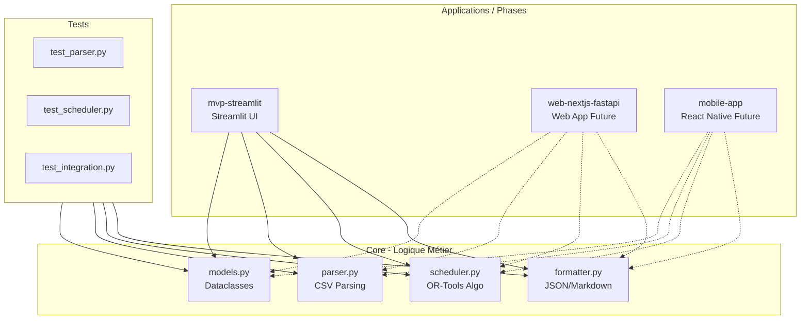
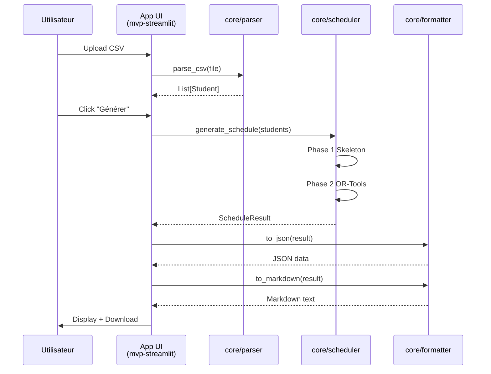

# 🏗️ Architecture SaaS Planz

Structure monorepo avec séparation claire core/apps pour scalabilité et réutilisabilité.

---

## 📐 Diagramme d'Architecture



---

## 🔷 Core - Logique Métier

**Rôle :** Code métier pur, indépendant de toute interface ou framework

**Modules :**

### `models.py` (220 lignes)
- Dataclasses : `Slot`, `Student`, `ScheduledClass`, `ScheduleResult`
- Validation : Durée 1h, granularité :00/:30
- Logique overlap (half-open intervals)

### `parser.py` (340 lignes)
- Parsing CSV avec pandas
- Validation format, temps, linked groups
- Expansion plages horaires → slots 1h

### `scheduler.py` (650 lignes)
- Algorithme 2-phase (Skeleton + OR-Tools)
- CP-SAT solver avec contraintes hard/soft
- Progressive timeout (0-5s, 5-10s, 10-15s)
- Graceful degradation

### `formatter.py` (200 lignes)
- Export JSON structuré
- Export Markdown human-readable
- Template-based (no LLM cost)

**Total core :** ~1,410 lignes

---

## 📱 Apps - Interfaces par Phase

### Phase 1 : `apps/mvp-streamlit/` (Actuelle ✅)

**Tech Stack :**
- Streamlit (UI web simple)
- Python 3.11
- Docker

**Features :**
- Upload CSVs
- Blocage créneaux coach
- Génération planning
- Download résultats

**Lancer :**
```bash
./run-mvp.sh start
```

---

### Phase 2 : `apps/web-nextjs-fastapi/` (Future)

**Tech Stack (planifié) :**
- Next.js 14 (frontend)
- FastAPI (backend)
- PostgreSQL (Supabase/Neon)
- Clerk/Supabase Auth

**Features (planifiées) :**
- Multi-tenant
- Authentification
- Persistance BDD
- API REST
- Dashboard analytics

**Réutilise :**
- `core/scheduler.py` via API calls
- `core/models.py` pour DTOs
- `core/formatter.py` pour exports

---

### Phase 3 : `apps/mobile-app/` (Future)

**Tech Stack (planifié) :**
- React Native ou Flutter
- API calls vers Phase 2 backend

**Features (planifiées) :**
- Notifications push
- Mode offline
- Scan QR codes
- WhatsApp integration

**Réutilise :**
- API de Phase 2
- Core logic via backend

---

## 🧪 Tests

**Structure :**
```
tests/
├── test_parser.py         # Tests core/parser.py
├── test_scheduler.py      # Tests core/scheduler.py
├── test_integration.py    # Tests end-to-end
└── fixtures/              # CSV de test
```

**Tous les tests ciblent le `core/`** (indépendant des apps)

---

## 🔄 Flux de Données



---

## 🎯 Principes de Design

### 1. Séparation Core / Apps

- **Core** = Logique métier pure (no UI, no framework)
- **Apps** = Interfaces spécifiques (Streamlit, Next.js, etc.)
- Communication via imports Python standards

### 2. Réutilisabilité

```python
# Dans mvp-streamlit/app.py
from core.scheduler import generate_schedule

# Dans web-nextjs-fastapi/api.py (future)
from core.scheduler import generate_schedule

# Même code, différentes interfaces ✅
```

### 3. Testabilité

- Tests du core indépendants des apps
- Tests UI spécifiques à chaque app
- Mock facile (core est pur Python)

### 4. Scalabilité

Ajouter une phase = créer un dossier dans `apps/`
- Pas besoin de toucher au core
- Pas besoin de toucher aux autres apps
- Configuration Docker isolée

---

## 🚀 Roadmap

### Phase 1 : MVP Streamlit (Actuelle ✅)

**Status :** ✅ Complete  
**Dossier :** `apps/mvp-streamlit/`  
**But :** Valider l'algo avec Tony

### Phase 2 : Web App Multi-tenant

**Status :** Planifiée  
**Dossier :** `apps/web-nextjs-fastapi/` (à créer)  
**But :** SaaS commercial pour coachs

### Phase 3 : Mobile App

**Status :** Planifiée  
**Dossier :** `apps/mobile-app/` (à créer)  
**But :** App mobile native

### Phase 4 : Intégrations

**Status :** Planifiée  
**Dossier :** `apps/whatsapp-bot/`, etc.  
**But :** Collecte automatique disponibilités

---

## 📊 Comparaison

| Aspect | Avant | Après |
|--------|-------|-------|
| **Structure** | Plate | Monorepo hiérarchique |
| **Core** | Mélangé avec UI | ✅ Isolé dans `core/` |
| **Réutilisabilité** | Difficile | ✅ Facile (import core) |
| **Scalabilité** | Difficile | ✅ Ajouter dans `apps/` |
| **Phases** | 1 seule | ✅ N phases possibles |
| **Tests** | Mélangés | ✅ Centralisés |
| **Docker** | 1 config | ✅ Config par app |

---

## 📚 Documentation

- **README principal** : `README.md`
- **Quick Start** : `QUICKSTART.md` (ce fichier)
- **Structure détaillée** : `STRUCTURE.md`
- **Réorg détaillée** : `REORGANIZATION_CORE_APPS.md`

---

**Version :** 2.0.0 (Structure core/apps)  
**Date :** 2026-02-02  
**Status :** ✅ Production-ready
